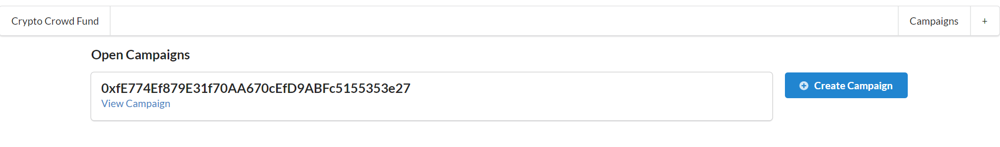
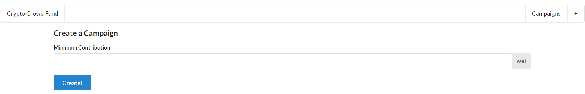

# Campaign Contract

This project allows people to construct and participate in a crowd funding campaign. The novel mechanism this contract allows is a voting system on spending proposals made by the campaign creator. Introducing this ability solves a major problem of transparency and fraud vulnerability common to crowd funding efforts.

Two Contracts are used to accomplish this goal:

* The Campaign Factory Contract
  Used to make and keep track of all campaigns

* The Campaign Contract
  * Request Struct 
    This is a request by the author of the campaign for approval to spend funds 
    Multiple requests can exist for a single campaign 
    Those who have voted yes are saved in a mapping so they cannot vote twice 
     
    
  * contribute 
    anyone is able to send ether to this contract 
    they are then added to a list of contributers 
     
  * createRequest 
    the request object is created through the parameters for this function 
     
  * approveRequest 
    if a person has already contributed to this campagin, they are able to approve an individual request 
     
  * finalizeRequest 
    author of contract is able to access the funds if a majority of approvals has been reached 
